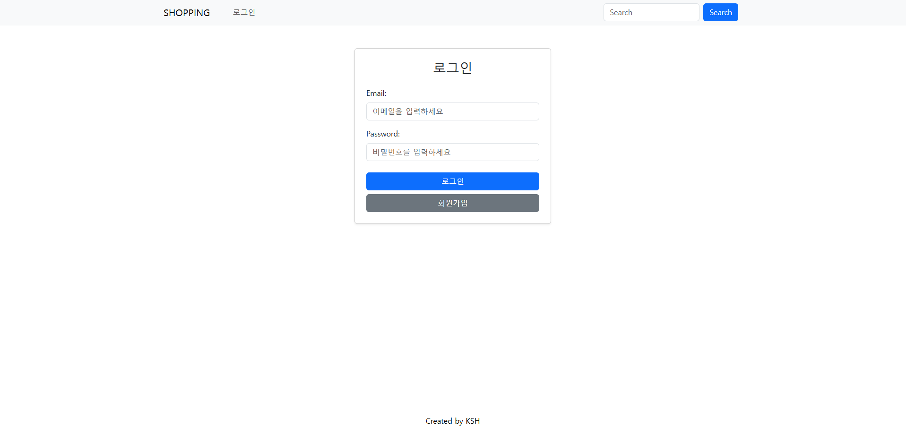
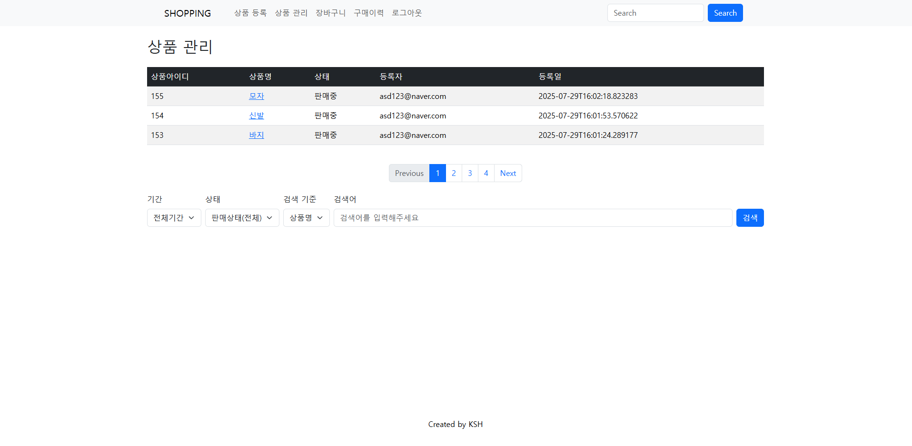
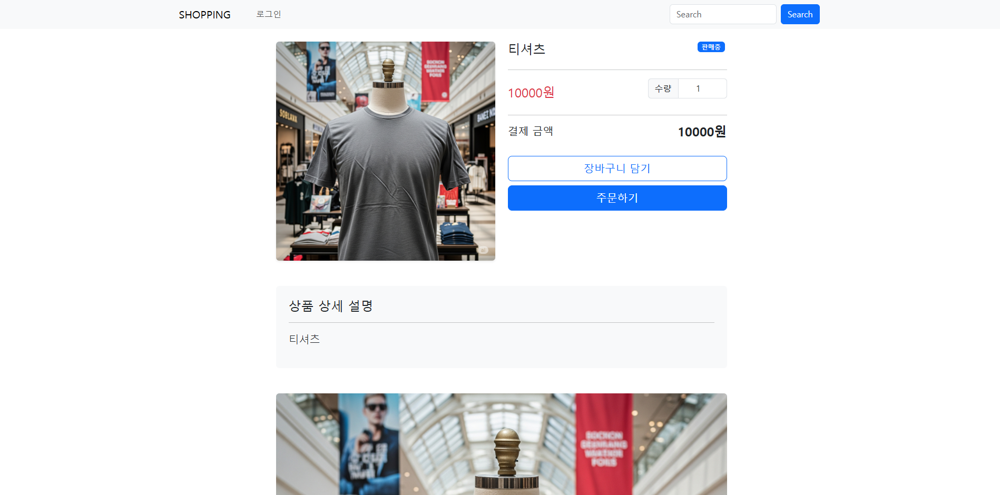
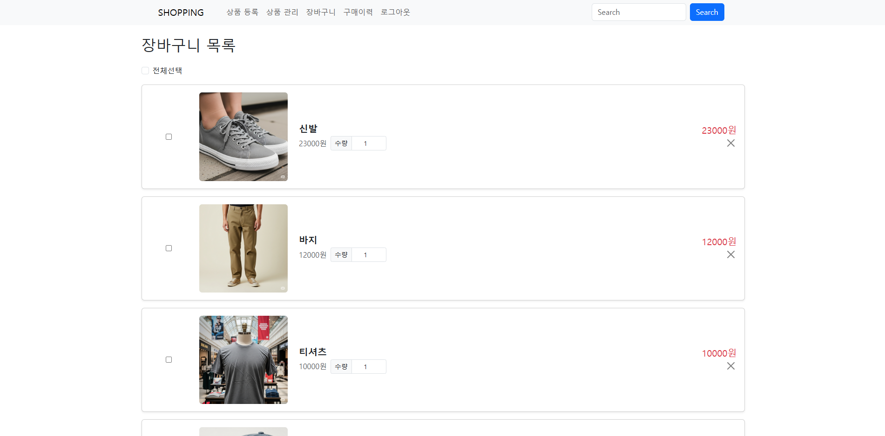

# 🛍️ 쇼핑몰 프로젝트

Spring Boot 기반의 쇼핑몰 웹 애플리케이션입니다.  
사용자는 상품을 장바구니에 담고 주문하며 리뷰를 작성할 수 있고, 관리자는 상품을 등록·수정·삭제할 수 있습니다.

배포링크 : https://shop-bm68.onrender.com/

---

## 🛠️ 기술 스택

| 구분 | 기술 |
|------|------|
| Language | Java 17 |
| Framework | Spring Boot, Spring Security, JPA, Thymeleaf |
| Database | MySQL, H2 |
| ORM | Spring Data JPA, QueryDSL |
| View | Thymeleaf, Bootstrap, jQuery |
| Build Tool | Gradle |
| Validation | Hibernate Validator (@Valid, BindingResult) |
| Deployment | Docker, Render |

---

## ✅ 주요 기능

### 👤 회원
- 회원가입, 로그인/로그아웃 (Spring Security)
- 회원가입 시 유효성 검증 및 에러 메시지 출력
- 권한(Role)에 따라 접근 제한 (`USER`, `ADMIN`)

### 🛒 상품
- 상품 등록 / 수정 / 삭제 (관리자 전용)
- 이미지 업로드 및 대표 이미지 지정
- 메인 페이지 상품 목록 (페이징 & 검색 가능)

### 🧺 장바구니
- 상품 장바구니 담기 (Ajax)
- 수량 변경 / 삭제 / 전체 선택
- 총 주문 금액 실시간 계산

### 📦 주문
- 장바구니 선택 상품 주문
- 주문 이력 확인 및 취소 기능
- 주문 권한 검증

### ⭐ 리뷰
- 상품 리뷰 등록 (평점, 코멘트)
- 본인 작성 리뷰만 삭제 가능
- Ajax 기반 리뷰 등록 및 렌더링

---

## 📁 프로젝트 구조

- shop
- ├── config # 보안 및 Web 설정 (Spring Security, Auditing 등)
- ├── controller # 웹 요청 처리 (상품, 장바구니, 주문, 리뷰 등)
- ├── dto # 요청/응답용 DTO
- ├── entity # JPA 엔티티
- ├── repository # JPA/QueryDSL 기반 Repository
- ├── service # 비즈니스 로직 처리
- ├── templates # Thymeleaf 템플릿 (HTML)
- └── static # 정적 자원 (JS, CSS) 

---

|                                                           |
|-----------------------------------------------------------|
| 메인화면                                                      |
|          |
| 로그인                                                       |
|        |
| 상품등록                                                      |
|  |
| 상품관리                                                      |
|    |
| 상품상세페이지                                                   |
|        |
| 장바구니                                                      |
|          |

---